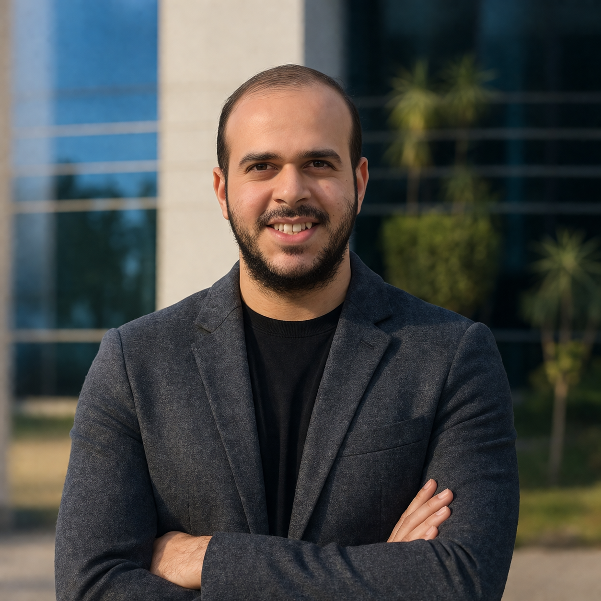

<div align="center">



# Hi, I'm Mahmoud Ahmed Mahran 👋

### 🚀 Digital Twin Engineer | AI Engineer | Industrial IoT Engineer | Unity Developer


</div>

---

<p align="center">

</p>

---

# 🚀 About Me

I'm a multidisciplinary engineer specializing in:

- 🏭 Digital Twins
- 🤖 Artificial Intelligence
- 🧠 Machine Learning & Deep Learning
- 🎯 Reinforcement Learning
- 📡 Industrial IoT
- 🎮 Unity Simulation & XR
- 🔄 Predictive Maintenance
- 🦾 Robotics & ROS2

My mission is to bridge the physical world and intelligent virtual systems for Industry 4.0.

---

# 🧠 Artificial Intelligence

## Machine Learning

- Regression Models
- Classification Models
- Ensemble Learning
- Feature Engineering
- Time-Series Forecasting
- Predictive Maintenance

## Deep Learning

- Neural Networks
- CNN
- RNN
- LSTM
- Autoencoders
- Transfer Learning

## Reinforcement Learning

- Q-Learning
- Deep Q Networks (DQN)
- PPO
- Policy Gradient
- Robotics Control
- Intelligent Agents

## Generative AI

- LangChain
- LlamaIndex
- RAG Systems
- Multi-Agent Systems
- OpenAI APIs
- Vector Databases
- Prompt Engineering

---

# 🏭 Digital Twin & Industrial IoT

### Industrial Protocols

- OPC UA
- MQTT
- Modbus

### Edge Computing

- Node-RED
- InfluxDB
- Grafana

### Real-Time Systems

- Telemetry Synchronization
- Predictive Maintenance
- Time-Series Analytics

### Simulation

- Unity 3D
- ROS2
- XR
- Robotics Simulation

---

# 📈 Skill Matrix

```text
Artificial Intelligence      ███████████████████ 95%

Machine Learning             ██████████████████ 92%

Deep Learning                █████████████████ 90%

Generative AI                ███████████████████ 95%

Digital Twins                ███████████████████ 96%

Industrial IoT               █████████████████ 90%

Predictive Maintenance       █████████████████ 90%

Unity Simulation             █████████████████ 90%

Python                       ███████████████████ 95%

ROS2                         ███████████████ 85%
```

---

# ⚙ Industry 4.0 Architecture

```text

            Sensors / Robots
                    ↓

          OPC UA • MQTT • Modbus
                    ↓

            Edge Layer
      Node-RED • InfluxDB • Grafana
                    ↓

             AI Models
      ML • DL • RL • Generative AI
                    ↓

            Digital Twin
              Unity 3D
                    ↓

       Dashboard & Monitoring

```

---

# 🛠 Tech Stack

## AI & Data Science

<p>


</p>

## Generative AI

<p>


</p>

## Industrial IoT

<p>


</p>

## Robotics & Simulation

<p>


</p>

---

# 📂 Featured Projects

## 🏭 Industrial Digital Twin

Real-time synchronization between physical assets and virtual replicas.

**Tech Stack**

Unity • OPC UA • MQTT • InfluxDB

---

## 🤖 AI Industrial Assistant

RAG-based assistant for maintenance and troubleshooting.

**Tech Stack**

Python • LangChain • OpenAI • Vector Database

---

## 📈 Predictive Maintenance

Time-series forecasting and anomaly detection for industrial robots.

**Tech Stack**

Python • LSTM • PyTorch • MLflow

---

## 🎮 Smart Factory Simulation

Virtual factory and robotics simulation.

**Tech Stack**

Unity • Blender • ROS2

---

# 📊 GitHub Analytics

<p align="center">


</p>

---

<p align="center">


</p>

---

# 🏆 GitHub Trophies

<p align="center">


</p>

---

# 🐍 Contribution Snake

<p align="center">


</p>

---

# 🌐 Connect With Me

<p align="center">

<a href="https://github.com/mhranahmed990-tech">

</a>

<a href="https://www.linkedin.com/in/mahmoud-ahmed-mahran-b24162243/">

</a>

<a href="https://mahmoudmahranportofolio.netlify.app">

</a>

</p>

---

<div align="center">

# ⚡ Building Intelligent Cyber-Physical Systems for Industry 4.0 ⚡


</div>
